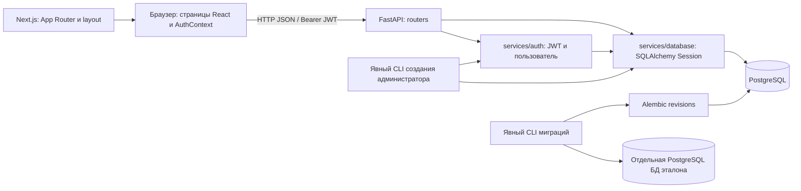

# Текущая архитектура Lingvar

Карта фактического кода: текстовые упражнения, API, данные и окружение.
Новая схема и backend проверены на отдельной тестовой PostgreSQL; состояние
действующей БД здесь не описывается. Продуктовая основа —
[модель обучения](LEARNING_MODEL.md), действующие ограничения —
[решения](DECISIONS.md), порядок сопровождения карты —
[процесс разработки](DEVELOPMENT_PROCESS.md).

## Компоненты и границы

**Frontend.** [Next.js 14, React 18, TypeScript и Tailwind](../frontend/package.json).
[App Router](../frontend/src/app/) задаёт реальные маршруты; корневой
[layout](../frontend/src/app/layout.tsx) подключает `AuthProvider`, внутри которого
[RoleRouteGuard](../frontend/src/components/RoleRouteGuard.tsx) разделяет учебные
и административные экранные маршруты после восстановления пользователя.
Страницы выполняют HTTP-запросы и хранят состояние упражнений в React.
[Компоненты](../frontend/src/components/) разделены на atoms (контролы),
molecules (формы, карточки), organisms (навигация, сетки, интерактивная таблица)
и templates (макеты). В `components/pages` есть дополнительные реализации
страниц; точкой входа маршрутов остаётся `src/app`. Административное управление
правилами находится в [маршрутах admin/rules](../frontend/src/app/admin/rules/),
а дерево, форма свойств и защита несохранённого состояния — в
[компонентах admin](../frontend/src/components/admin/).

[lib/api.ts](../frontend/src/lib/api.ts) содержит адрес backend, константы API,
хранение токена и методы работы с пользователями. Учебные страницы используют
`fetch` напрямую с этими константами и заголовками авторизации. Адрес API задан
в коде как `http://localhost:8000`; Next.js-прокси для запросов не настроен в
[next.config.js](../frontend/next.config.js).

**Backend.** [main.py](../backend/main.py) создаёт FastAPI, CORS и подключает
роутеры. Обработчики в [routers](../backend/routers/) совмещают HTTP-контракт,
SQLAlchemy-запросы и преобразование ответа; отдельного учебного сервисного слоя
нет. [services/auth.py](../backend/services/auth.py) отвечает за пароли, JWT и
зависимости активного пользователя, ученика и администратора;
[services/database.py](../backend/services/database.py)
— за engine и сессии. [services/migrations.py](../backend/services/migrations.py)
и [migrate.py](../backend/migrate.py) управляют проверкой версии, явным upgrade
и регистрацией существующей схемы. Перед `yield` lifespan проверяет, что
версия БД равна единственной head; при недоступной или неподготовленной БД
backend не стартует. [models](../backend/models/) содержат
ORM и модели запросов/ответов пользователей; часть Pydantic-моделей объявлена
непосредственно в роутерах. Синхронные SQLAlchemy-сессии используются внутри
`async`-обработчиков; `get_db` закрывает сессию после запроса, запись фиксируется
явным `commit` обработчика.

## API и основные потоки

**Вход.** [Страница login](../frontend/src/app/login/page.tsx) вызывает
[AuthContext.login](../frontend/src/contexts/AuthContext.tsx): `POST /users/token`
передаёт имя и пароль как form-urlencoded; backend проверяет bcrypt-хеш и выдаёт
JWT HS256 с `sub=username`, сроком 30 минут. Frontend сохраняет токен и его тип
в `localStorage`, затем получает `GET /users/me`. При загрузке страницы контекст
восстанавливает пользователя через этот же запрос; выход очищает локальный токен.
Refresh-токена и серверной сессии нет. Учебные API требуют активного пользователя
без `is_superuser`, административный API — активного пользователя с этим
признаком. После входа frontend направляет ученика на `/`, администратора — на
`/admin`. Общий ролевой guard направляет неаутентифицированного посетителя
защищённых страниц на вход, не показывает `/admin` ученику и возвращает
администратора с остальных экранных маршрутов в `/admin`. Это клиентская граница
навигации; окончательное разграничение учебных и административных данных выполняет
backend.

[Роутер users](../backend/routers/users.py) также предоставляет
`POST /users/register` и список пользователей для авторизованного ученика.
[Страница signup](../frontend/src/app/signup/page.tsx) отправляет
`username`, `email`, `password` через [ApiService.register](../frontend/src/lib/api.ts)
на этот endpoint. При успехе она переходит на `/login` с подтверждением,
которое показывает форма входа; автоматического входа после регистрации нет.
При ошибке регистрации форма показывает сообщение и сохраняет введённые поля.
[Frontend middleware](../frontend/middleware.ts) проверяет cookies/Authorization
для `/dashboard`, `/profile`, `/settings`; эти маршруты отсутствуют, а штатный
вход сохраняет токен только в `localStorage`. Защита учебного API осуществляется
backend, а не этим middleware.

**Таблицы форм.** [Каталог lessons](../frontend/src/app/lessons/page.tsx) задан
в frontend. Страницы [существительных](../frontend/src/app/lessons/singular-nouns/page.tsx),
[местоимений](../frontend/src/app/lessons/pronouns/page.tsx) и
[глаголов](../frontend/src/app/lessons/verbs/page.tsx) получают плоские строки
`id`, `word`, формы по падежам/лицам и передают их в
[InteractiveLessonTable](../frontend/src/components/organisms/InteractiveLessonTable.tsx).
Backend [nouns](../backend/routers/nouns.py) выдаёт 20 случайных слов
(`/api/nouns/single`, `/plural`), [pronouns](../backend/routers/pronouns.py) —
все местоимения по ID, [verbs](../backend/routers/verbs.py) — 20 глаголов
с персональным ранжированием. Страница
[plural-nouns](../frontend/src/app/lessons/plural-nouns/page.tsx) пока содержит
макет без учебной таблицы и не использует API множественного числа.

**Результаты таблиц и повторение.** Таблица сравнивает ввод с полученной формой
в браузере, игнорируя регистр и пробелы по краям ввода. После правильного ответа
или трёх ошибок открывает форму. Каждая проверка отправляет
`POST /api/tests/attempt` с `word_type`, `word_id`, `is_correct`; после открытия
всех ячеек слова отправляется `/complete` с `all_correct`. Кнопки веса вызывают
`/weight`; backend ограничивает вес диапазоном −5…5.
[Роутер tests](../backend/routers/tests.py) сохраняет агрегаты `WordTestStat`
для текущего пользователя: число попыток/успехов, отметку завершения и время,
ручной вес. Корректность определяется клиентом; backend не получает текст
ответа или ID формы и не перепроверяет его. Истории отдельных ответов нет.

Только выдача глаголов учитывает эти агрегаты: долю ошибок, давность завершения
(насыщение за 30 дней), отсутствие попыток и ручной вес; равные оценки
разрешаются случайным порядком. Это ранжирование слов, а не оценка запоминания
частей грамматического правила. Для существительных и местоимений персональные
результаты таблиц записываются, но при их выдаче не используются.

**Отдельные упражнения.** [Каталог exercises](../frontend/src/app/exercises/page.tsx)
получает фиксированный список из общего backend-
[каталога](../backend/routers/exercises/catalog.py) через
[главный роутер](../backend/routers/exercises/main.py).
Подроутеры [dopełniacz](../backend/routers/exercises/dopelniacz.py) и
[mianownik](../backend/routers/exercises/mianownik.py) выбирают по 50 случайных
существительных, [numerators](../backend/routers/exercises/numerators.py) —
20 случайных числительных. Формы и переводы передаются вместе с заданиями.
Страницы [dopełniacz](../frontend/src/app/exercises/dopelniacz-pojed/page.tsx)
позволяют раскрыть ответ и отметить результат самостоятельно;
[числительные](../frontend/src/app/exercises/numerators/page.tsx) и
[mianownik](../frontend/src/app/exercises/mianowniki-mnoga/page.tsx) проверяют
ввод с тремя попытками. Результаты этих страниц остаются в React и не отправляются
в `/api/tests`. Сейчас запрос данных одновременно используется как запрос
метаданных упражнения, хотя backend возвращает массив заданий. В каталоге путь
`/api/exercises/mianowniki/mnoga` расходится с реализованным `/mianownik/mnoga`;
сама страница использует реализованный путь. Это несоответствия контрактов,
а не согласованный способ разделения данных и метаданных.

**Прочие API и административный контур.** [misc](../backend/routers/misc.py)
содержит публичный health check и доступную только ученику проверку БД.
[Admin router](../backend/routers/admin/main.py) требует активного администратора
для всего префикса `/admin`. Он предоставляет `GET /admin/exercises`: проекцию
общего каталога только с `id` и `title`, без заданий и адресов их выполнения.
[Страница `/admin`](../frontend/src/app/admin/page.tsx) показывает эти строки без
действий и имеет состояния загрузки, ошибки и пустого каталога.

[Rules router](../backend/routers/admin/rules.py) реализует административный CRUD
дерева через `GET/POST /admin/rules` и `PUT/DELETE /admin/rules/{id}`. Чтение
возвращает весь лес вложенными узлами. Мутации сериализуются PostgreSQL-блокировкой
`SHARE ROW EXCLUSIVE`; перенос проверяется рекурсивным CTE, поэтому правило нельзя
сделать потомком самого себя. Создание и перенос добавляют узел в конец уровня.
Удаление одним commit сначала SQL-операциями переносит прямых потомков к прежнему
родителю (или в корень), затем удаляет узел; rollback отменяет обе части.
[Список правил](../frontend/src/app/admin/rules/page.tsx), отдельное создание и
двухпанельный редактор полного дерева используют один ответ с полным лесом,
фильтруют недопустимых родителей на клиенте и после каждой успешной мутации
перечитывают серверное состояние. Backend остаётся окончательной границей
валидации и доступа.

## Данные и схема

Общая [Base](../backend/services/base.py) объединяет ORM-модели.
Пользователь описан в [user.py](../backend/models/user.py), учебные сущности —
в [vocabulary.py](../backend/models/vocabulary.py).

| Таблица | Содержимое и связи |
|---|---|
| `users` | Уникальные username/email, хеш пароля, активность и `is_superuser`, временные метки. |
| `nouns` | Слово и обязательные JSONB `cases_pojed`, `cases_mnoga`, `cases_menska` с формами. |
| `pronouns`, `verbs` | Слово и JSONB `cases`: падежи местоимения или лица глагола. |
| `numerators` | Польское слово и строка перевода. |
| `rules` | Название/описание, `parent_rule_id → rules.id`, порядок; self-reference задаёт дерево правил. |
| `word_test_stats` | Составной PK `(user_id, word_type, word_id)`; FK только `user_id → users.id`, агрегаты попыток, вес, последнее завершение. |

Связь статистики со словом полиморфная по типу и ID, без FK на словарные таблицы.
Нет связей заданий или слов с `rules`, таблиц уроков/блоков, истории ответов
и персонального прогресса по частям правил. Дерево `Rule` редактируется только
через административный контур; учебные роутеры его не читают. Согласованная
[модель обучения](LEARNING_MODEL.md) не реализована наличием этой таблицы:
снижение оценки запоминания, сводка родителя и подбор по частям правил отсутствуют;
их открытые продуктовые вопросы здесь не разрешаются.

**Создание и изменение схемы.** [Alembic](../backend/migrations/env.py) применяет
версионированные revisions. [Initial revision](../backend/migrations/versions/0001_initial_schema.py)
явно создаёт семь таблиц, индексы и FK в пустой PostgreSQL; её downgrade
отказывает, чтобы не удалить данные. [CLI](../backend/migrate.py) содержит
`upgrade`, `check`, `check-legacy`, `baseline`. Штатный порядок — явный `upgrade`
до запуска backend; `create_all` из запуска и сервиса БД удалён.

[create_admin.py](../backend/create_admin.py) — отдельная явно запускаемая команда:
проверяет актуальность миграций, валидирует переданные имя, email и пароль,
хеширует пароль и создаёт активного пользователя с `is_superuser=true` одной
транзакцией. По умолчанию пароль читается скрыто с подтверждением; режим
`--password-stdin` предназначен для управляемого неинтерактивного запуска.

Для перехода legacy [validator](../backend/services/migrations.py) выполняет
initial revision в отдельной пустой PostgreSQL `lingvar_migration_reference`
в транзакции, снимает снимок `pg_catalog` и откатывает эталон. `check-legacy`
сравнивает фактическую структуру target только чтением; при расхождении отказывает.
`baseline` повторяет сравнение под advisory-блокировкой и блокировками таблиц,
затем в той же target-транзакции регистрирует initial revision без выполнения
её DDL. Снимок сравнивает учебные таблицы/колонки/ограничения/индексы/
последовательности, параметры locale/encoding и неизвестные объекты `public`;
учитывает зависимости views из других схем. Объекты `uuid-ossp` исключаются
по принадлежности расширению. Прямой `alembic stamp` запрещён конфигурацией
миграций; пустая или неизвестная версия запрещает upgrade. Миграционные
транзакции используют локальный `search_path` `public,pg_catalog`. Сторонний
DDL на время baseline исключается эксплуатационно. Фактическая схема БД
учеников не включена в эту карту; её изменение требует отдельного указания PO.
[01-init.sql](../database/init/01-init.sql) выполняется PostgreSQL при первичной
инициализации тома и задаёт расширение/права, а не учебную схему.
[add_dopelniacz_rule.py](../backend/add_dopelniacz_rule.py) — отдельный скрипт
добавления учебных записей `Rule` в обычную БД, не миграция и не часть старта.

## Окружение и проверки

[docker-compose.yml](../docker-compose.yml) задаёт PostgreSQL 15, backend на
порту 8000 и Next.js на порту 8087. Данные PostgreSQL хранятся в bind mount
`database/data`; backend ожидает health check БД и работает с `DATABASE_URL`.
Исходники frontend/backend подключены томами; запускаются `npm run dev`
и Uvicorn с reload. [Образы](../backend/Dockerfile) используют Python 3.13;
[frontend-образ](../frontend/Dockerfile) — Node 19.
[requirements.txt](../backend/requirements.txt) задаёт Alembic и закрепляет
`bcrypt==4.0.1`, сохраняющий ожидаемые passlib 1.7.4 метаданные `__about__`.
`DATABASE_URL` обязателен и указывает PostgreSQL; SQLite fallback удалён.
Модели используют JSONB,
ранжирование — PostgreSQL-выражения. CORS разрешает указанные в `main.py`
адреса frontend.

[docker-compose.test.yml](../docker-compose.test.yml) задаёт отдельный project
`lingvar-tests` с PostgreSQL 15, БД `lingvar_test` и пользователем
`lingvar_test_user` на tmpfs, без host-порта и без
подключения `database/data`, штатной сети и учётных данных. Команды в
[README](../README.md) указывают явный `-p lingvar-tests`; cleanup
не затрагивает штатный project. [Общие фикстуры](../backend/tests/conftest.py)
требуют `TEST_DATABASE_URL` с выделенными PostgreSQL, host, пользователем и
именем БД, проверяют фактически подключённые имя/пользователя и версию 15 до
DDL, назначают backend тот же URL и очищают `public` до/после каждого теста.
[Тесты миграций](../backend/tests/test_migrations.py) вызывают CLI в subprocess,
запускают FastAPI lifespan через TestClient и проверяют пустую/обновлённую
схему, повторный initial, отказ старта без миграции и запрет downgrade/stamp.
[HTTP-сценарии](../backend/tests/test_user_workflow.py) проверяют путь регистрация
→ вход → авторизованная выдача слова → сохранение агрегата `word_test_stats`,
отказ повторной регистрации, создание администратора через настоящий CLI и
разделение всех защищённых учебных/admin endpoints. Сценарий правил там же
проверяет CRUD многоуровневого леса, запрет циклов, перенос прямых потомков и
rollback удаления через отклоняющий DELETE тестовый PostgreSQL-trigger. Тесты
явно применяют Alembic перед запросами, создают только синтетические данные и
читают сохранённый результат в тестовой PostgreSQL.

Сервис `browser-tests` собирается из [отдельного Dockerfile](../tests/browser/Dockerfile),
сбрасывает только проверенную тестовую схему, поднимает backend и frontend внутри
контейнера и запускает [Playwright-сценарий](../frontend/e2e/admin-access.spec.ts)
в системном Chromium. Он проверяет вход и ролевую навигацию администратора и
ученика поверх настоящих backend и PostgreSQL, а также создание, редактирование,
перенос и удаление многоуровневого дерева правил, состояния ошибки и защиты
несохранённого ввода. Конфигурация раннера находится в
[playwright.config.ts](../frontend/playwright.config.ts). В `frontend/package.json`
нет самостоятельного test-скрипта: штатная браузерная проверка запускается через
сервис compose.
