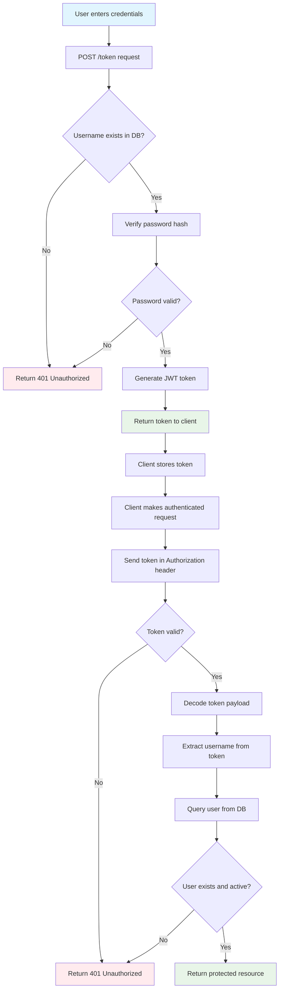
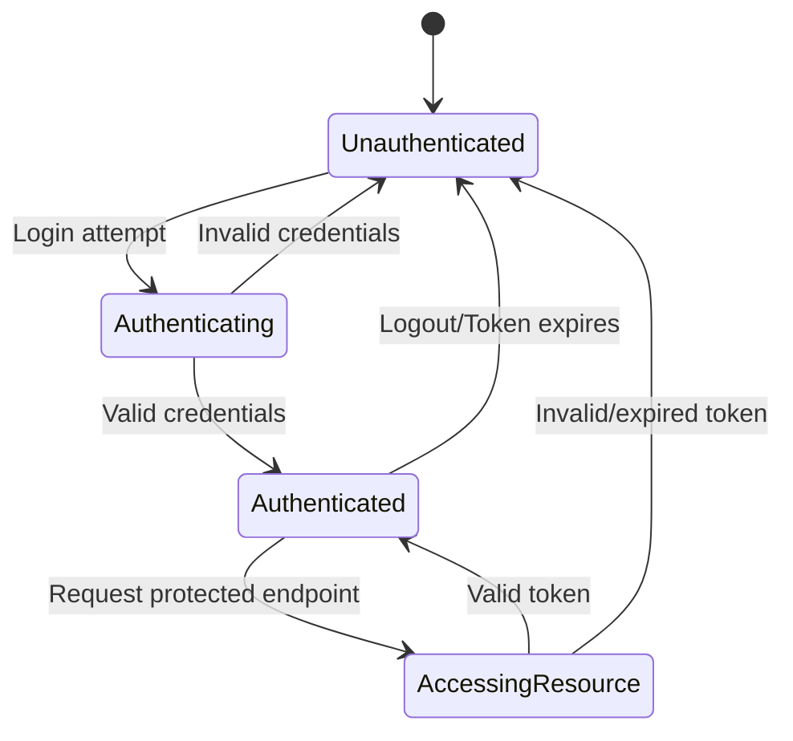

# Login Process Flowchart - Lingvar Backend

## Login Flow Decision Chart

## Authentication States

## Key Decision Points

1. **Username Validation**: Check if user exists in database
2. **Password Verification**: Compare provided password with stored hash
3. **Token Generation**: Create JWT with user identity and expiration
4. **Token Validation**: Verify token signature and expiration on each request
5. **User Status Check**: Ensure user account is still active
