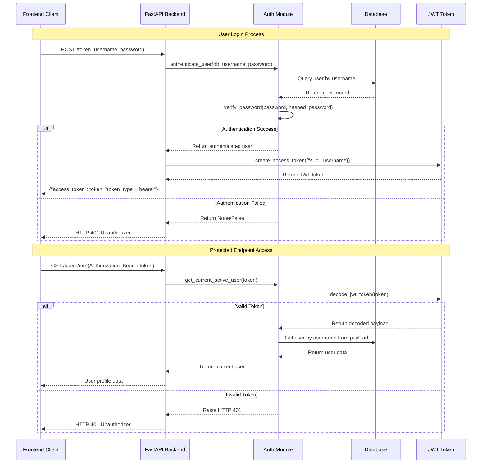

# Login Process Flow - Lingvar Backend

## Sequence Diagram

## Flow Description

1. **Login Request**: Client sends username/password to `/token` endpoint
2. **User Authentication**: Backend queries database and verifies password hash
3. **Token Generation**: If valid, creates JWT token with user identity
4. **Token Response**: Returns access token to client
5. **Protected Access**: Client uses token in Authorization header for protected endpoints
6. **Token Validation**: Backend validates token and extracts user identity for each request
